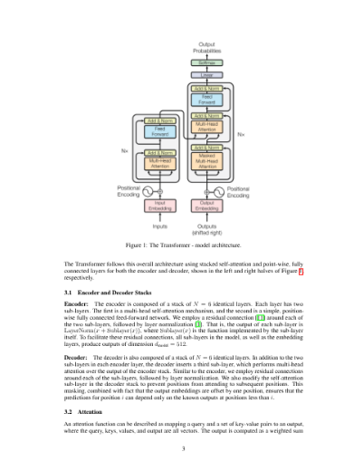
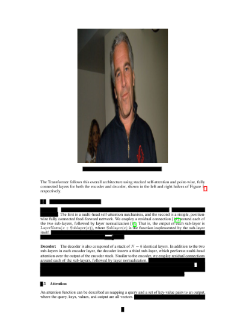

# Epsteinify
## Turn your PDFs into the Epstein files

| Before | Epsteinified! |
|--------|--------|
|  |  |


## Usage
```bash
git clone https://github.com/Techie-Ernie/epsteinify.git
cd epsteinify
pip install pymupdf
python epsteinify.py -f FILENAME 
```

Optionally, you can change the default Epstein images folder using ```-i``` or ```--images```.
You can change default number of lines to redact using ```-r``` or ```--redact```. 


